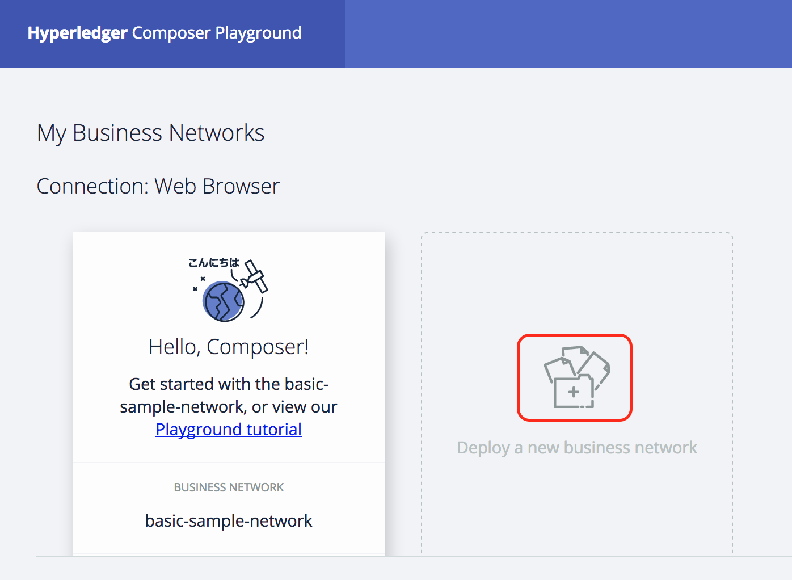
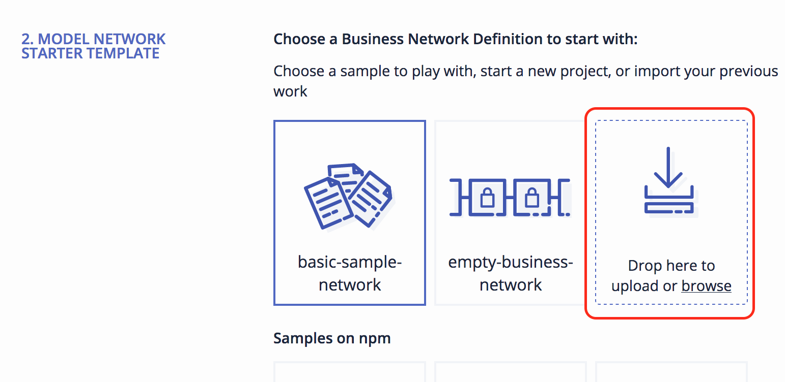
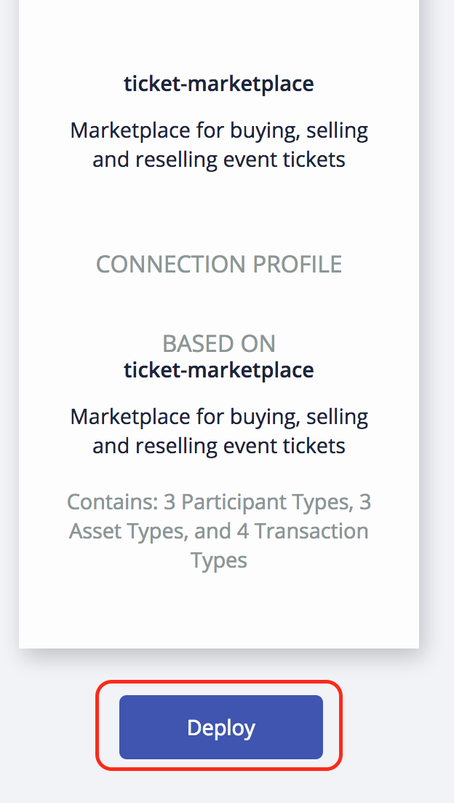
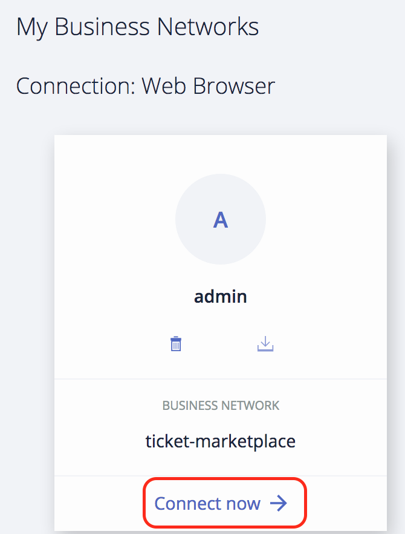
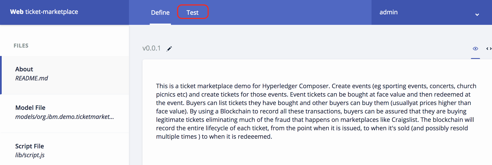

Event Ticket Network
=====================


> This is a ticket marketplace  demo for Hyperledger Composer. Create events (eg sporting events, concerts, church picnics etc) and create tickets for those events.  Event tickets can be bought at face value and then redeemed at the event. Buyers can list tickets they have bought and other buyers can buy them (usuallyat prices higher than face value).  By using a Blockchain to record all these transactions, buyers can be assured that they are buying legitimate tickets eliminating much of the fraud that happens on marketplaces like Craigslist. The blockchain will record the entire lifecycle of each ticket, from the  point when it is issued, to when it's sold (and possibly resold multiple times ) to when it is  redeeemed.

Business Network Description
============================

This business network defines:

**Participants:**

`Member` `EventHost`

   *Member* - A member of the general public that can buy and resell tickets.
   
   *EventHost* - The entity hosting an event and issuing tickets for it.

**Assets:**

`Ticket` `TicketListing` `Event`

   *Event* An event for which tickets are issued.
   
   *Ticket* - An individual ticket to a specific event.
   
   *TicketListing* - A listing to resell a ticket already purchased for an event

**Transactions:**

`CreateTicketedEvent` `RedeemTicket` `SellTicket` `ResellTicket`

   *CreateTicketedEvent* - Creates an event as well as the associated tickets. 
   
   *SellTicket* -  Used to record the sale of a ticket by the Event Host to a member.
   
   *ResellTicket* -  Used to record the resale  of a ticket to another member.
   
   *RedeemTicket* -  Records when the ticket is used at the event.
   
Prerequisites
-------------

You need the following software:

-   An Internet Explorer, Firefox, or Chrome web browser.

Part 1. Initial set up
=========================

1.  Create a folder on your local machine for this lab and download the following file to it:
    
    [ticketmarketplace.bna](dist/ticketmarketplace.bna)
    
2.  Launch Hyperledger Composer in your browser using the following URL <https://composer-playground.mybluemix.net/>

     Click on **Deploy a new business network**.
     
     
     
     Click on **Drop here to upload or browse**.
     
     
     
     Select the file ***ticketmarketplace.bna*** that you just downloaded and then click on **Deploy**.
     
     
     
     Click on **Connect now ->** in the tile for the Business Network you just deployed
     
     
     
     Click the **Test** tab
     
     
     
Part 2. Test the Business Network
=================================
     
1.  Test the network by creating participants, assets and running some transactions.

    
    In the `EventHost` participant registry, create a new participant with the following data.

    ```
    {
      "$class": "org.ibm.demo.ticketmarketplace.EventHost",
      "email": "jones@email.com",
      "firstName": "Pastor",
      "lastName": "Jones"
    }
    ```

    In the `Member` participant registry, create two participants with the following data.

    ```
    {
      "$class": "org.ibm.demo.ticketmarketplace.Member",
      "email": "memberA@email.com",
      "firstName": "Amy",
      "lastName": "Williams"
    }

    {

      "$class": "org.ibm.demo.ticketmarketplace.Member",
      "email": "memberB@email.com",
      "firstName": "Billy",
      "lastName": "Thompson"
    }
    ```

    Submit a `CreateTicketedEvent` transaction, by clicking on **Submit Transaction**  and selecting `CreateTicketedEvent` from the dropdown. Use the following input data.

    ```
    {
      "$class": "org.ibm.demo.ticketmarketplace.CreateTicketedEvent",
      "eventId": "1001",
      "date": "09/21/2017",
      "description": "Church Picnic",
      "venue": "Austin Methodist Church",
      "eventType": "OPEN_SEATING",
      "numberOfTickets": 5,
      "ticketFaceValue": 10,
      "host": {
        "$class": "org.ibm.demo.ticketmarketplace.EventHost",
        "email": "jones@email.com",
        "firstName": "Pastor",
        "lastName": "Jones"
      }
    }
    ```

    Submit a `SellTicket` transaction, by submitting a transaction and selecting `SellTicket` from the dropdown. Use the following input data.

    ```
    {
      "$class": "org.ibm.demo.ticketmarketplace.SellTicket",
      "salePrice": 10,
      "buyer": "resource:org.ibm.demo.ticketmarketplace.Member#memberA@email.com",
      "ticket": "resource:org.ibm.demo.ticketmarketplace.Ticket#1"
    }
    ```

    In the `TicketListing` asset registry create a new ticket listing. Use the following input data.

    ```
    {
      "$class": "org.ibm.demo.ticketmarketplace.TicketListing",
      "listingId": "1",
      "state": "FOR_SALE",
      "listingPrice": 12,
      "ticket": "resource:org.ibm.demo.ticketmarketplace.Ticket#1"
    }
    ```

    Submit a `ResellTicket` transaction, by submitting a transaction and selecting `ResellTicket` from the dropdown. Use the following input data.

    ```
    {
      "$class": "org.ibm.demo.ticketmarketplace.ResellTicket",
      "salePrice": 12,
      "buyer": "resource:org.ibm.demo.ticketmarketplace.Member#memberB@email.com",
      "listing": "resource:org.ibm.demo.ticketmarketplace.TicketListing#1"
    }
    ```

    Submit a `UseTicket` transaction, by submitting a transaction and selecting `UseTicket` from the dropdown. Use the following input data.

    ```
    {
      "$class": "org.ibm.demo.ticketmarketplace.UseTicket",
      "ticket": "resource:org.ibm.demo.ticketmarketplace.Ticket#1"
    }
    ```


    If you click on the `Ticket` asset registry you can check the status  of each Ticket. You should see that one ticket was redeemed and all the others are unsold.

    Congratulations! You've successfully created and tested a Business Network. 